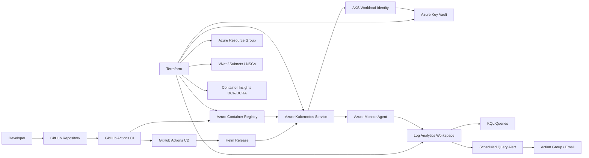
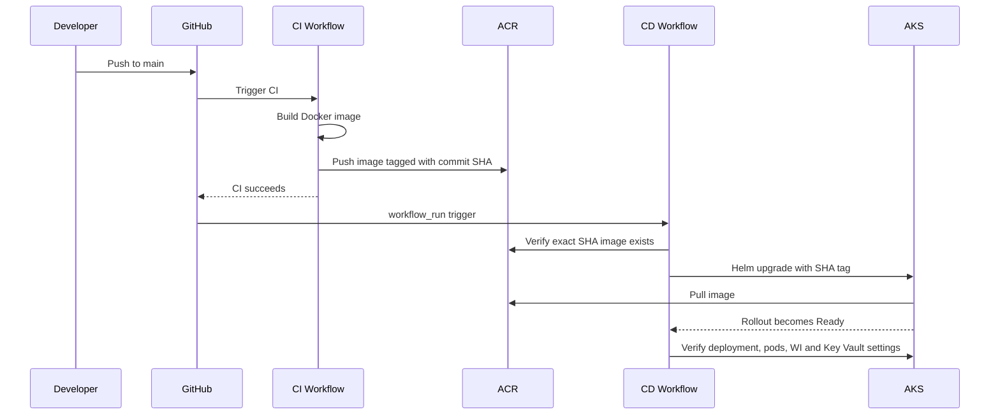
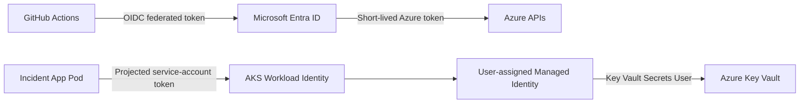
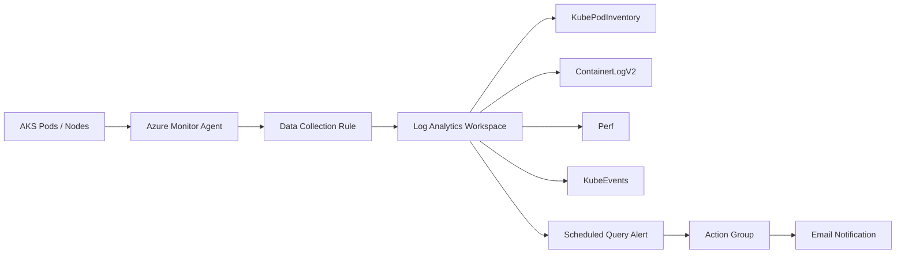

# Azure DevOps Platform Project

End-to-end Azure platform engineering project that provisions cloud infrastructure with Terraform, builds and publishes a containerized Flask application, deploys it to Azure Kubernetes Service with Helm, authenticates GitHub Actions to Azure through OIDC, accesses Azure Key Vault through AKS Workload Identity, and monitors the platform with Azure Monitor, Log Analytics, Container Insights, KQL, and alerting.

This project is intentionally designed as a production-style learning and portfolio implementation rather than a single-service demo. It demonstrates infrastructure as code, containerization, Kubernetes operations, CI/CD, identity, observability, incident response, and rollback in one integrated workflow.

## What this project demonstrates

- Modular Azure infrastructure provisioning with Terraform.
- Remote Terraform state stored in Azure Storage with state locking.
- Azure networking with VNet, subnets, NSGs, and AKS integration.
- Azure Container Registry with admin access disabled.
- AKS deployment using Azure CNI Overlay, Kubernetes RBAC, OIDC issuer, and Workload Identity.
- Docker image build and immutable SHA-based image tagging.
- Kubernetes Deployments, Services, ConfigMaps, probes, resource requests/limits, and HPA.
- Helm-based release management and rollback.
- GitHub Actions CI/CD authenticated to Azure with federated OIDC instead of stored Azure passwords.
- Azure Key Vault secret access from AKS through a user-assigned managed identity and federated service account.
- Azure Monitor, Log Analytics, Container Insights, Data Collection Rules, KQL, scheduled query alerts, and email notifications.
- Controlled production-style failure simulation using an invalid container image tag, diagnosis of `ImagePullBackOff`, and recovery through Helm rollback.

## Architecture



## Deployment flow



The CD workflow uses the exact CI commit SHA as the container tag. This makes each release traceable to source code and avoids relying on mutable tags such as `latest`.

## Security and identity flow



No application secret is stored inside the container image or Kubernetes manifest. GitHub Actions also authenticates to Azure using federation rather than a long-lived client secret.

## Observability flow



The implementation was validated with live pod inventory, application logs, Kubernetes events, CPU/memory telemetry, and a controlled alert test.

## Repository structure

```text
azure-devops-platform-project/
├── .github/
│   └── workflows/
│       ├── ci.yml
│       └── cd.yml
├── app/
│   ├── app.py
│   ├── Dockerfile
│   ├── requirements.txt
│   ├── static/
│   └── templates/
├── docs/
│   ├── architecture.md
│   ├── incident-response.md
│   ├── interview-guide.md
│   ├── kql-cheatsheet.md
│   ├── project-handbook.md
│   ├── repo-management.md
│   ├── runbook.md
│   └── troubleshooting-log.md
├── helm/
│   └── incident-app/
│       ├── Chart.yaml
│       ├── values.yaml
│       └── templates/
├── kubernetes/
│   └── base/
├── scripts/
│   └── repo-health-check.ps1
├── terraform/
│   ├── bootstrap/
│   ├── environments/dev/
│   └── modules/
│       ├── resource-group/
│       ├── network/
│       ├── nsg/
│       ├── acr/
│       ├── aks/
│       ├── key-vault/
│       ├── monitoring/
│       └── container-insights/
├── .gitignore
└── README.md
```

Local/generated folders such as `.venv`, `.terraform`, `__pycache__`, plan files, and Terraform state should not be committed.

## Technology stack

| Area | Technology |
|---|---|
| Cloud | Microsoft Azure |
| Infrastructure as Code | Terraform |
| Containers | Docker |
| Orchestration | Kubernetes / AKS |
| Release management | Helm |
| Registry | Azure Container Registry |
| CI/CD | GitHub Actions |
| Authentication | GitHub OIDC, Microsoft Entra ID, AKS Workload Identity |
| Secrets | Azure Key Vault |
| Monitoring | Azure Monitor, Log Analytics, Container Insights |
| Querying | KQL |
| Application | Python, Flask, Gunicorn |
| Automation / Operations | Azure CLI, kubectl, Helm, PowerShell |

## Application endpoints

| Endpoint | Purpose |
|---|---|
| `/` | CloudOps dashboard |
| `/health` | Readiness/health verification |
| `/version` | Application version / deployed image traceability |
| `/api/incidents` | Demo incident API |
| `/api/keyvault-check` | Verifies Workload Identity and Key Vault access without returning secret content |

## Terraform design

Terraform is split into two layers:

1. `terraform/bootstrap` creates the remote-state foundation.
2. `terraform/environments/dev` composes reusable modules for the platform.

The environment uses reusable modules for resource groups, networking, NSGs, ACR, AKS, Key Vault, monitoring, and Container Insights. This separates reusable resource definitions from environment-specific values and makes the design easier to extend to additional environments later.

### Typical Terraform workflow

```powershell
cd terraform\environments\dev
terraform fmt -recursive
terraform init
terraform validate
terraform plan
terraform apply
```

Never commit Terraform state, plan files, credentials, or secret values.

## CI pipeline

The CI workflow performs the application build path:

```text
Push to main
  -> GitHub OIDC login to Azure
  -> ACR login
  -> Docker build
  -> Image tag = Git commit SHA
  -> Push image to ACR
```

Using a commit SHA gives each image an immutable source-code reference.

## CD pipeline

The CD workflow runs after a successful CI workflow for `main` and deploys the exact CI commit SHA:

```text
Successful CI
  -> Checkout exact head SHA
  -> Azure OIDC login
  -> Get AKS credentials
  -> Verify SHA image exists in ACR
  -> Helm lint
  -> Helm upgrade --install
  -> Wait for rollout
  -> Verify deployed image / pods / identity settings
```

The normal deployment path uses rollback-on-failure protection. The deliberate failure exercise bypassed that safeguard so the diagnosis and manual rollback process could be demonstrated.

## Kubernetes deployment design

The application runs with two baseline replicas and a rolling update strategy designed to preserve availability:

```yaml
strategy:
  type: RollingUpdate
  rollingUpdate:
    maxUnavailable: 0
    maxSurge: 1
```

This behavior was proven during the controlled bad-image deployment: the new pod entered `ImagePullBackOff`, while both previous healthy replicas remained available.

The chart also configures health probes, resources, environment configuration, HPA, and the workload identity service account.

## Key Vault and Workload Identity

The application uses `DefaultAzureCredential` and does not contain an Azure password. In AKS, Azure Identity resolves the projected Workload Identity token and exchanges it for an Azure access token associated with the user-assigned managed identity.

The pod only exposes whether the secret was successfully loaded; the secret value is never returned by the validation endpoint.

## Monitoring and KQL

The platform collects Kubernetes and container telemetry into Log Analytics. Useful tables include:

- `KubePodInventory`
- `ContainerLogV2`
- `Perf`
- `KubeEvents`
- `KubeNodeInventory`

Example error query:

```kusto
ContainerLogV2
| where TimeGenerated > ago(30m)
| where PodNamespace == "cloudops-dev"
| where ContainerName == "incident-app"
| where LogMessage has_any ("ERROR", "Exception", "Failed", "Forbidden", "Traceback")
| project TimeGenerated, PodName, LogMessage
| order by TimeGenerated desc
```

See `docs/kql-cheatsheet.md` for operational queries used during the project.

## Controlled incident and rollback

A release was intentionally attempted using a nonexistent ACR tag:

```text
incident-app:broken-image-test
```

Observed behavior:

```text
Bad image tag
  -> New ReplicaSet created
  -> ACR tag not found
  -> ErrImagePull / ImagePullBackOff
  -> New pod never Ready
  -> Helm --wait timed out
  -> Existing replicas remained healthy
```

The root cause was confirmed by inspecting the pod image and querying ACR, which returned that the tag did not exist. The release was then rolled back to the known-good Helm revision and validated through `/health` and `/api/keyvault-check`.

See `docs/incident-response.md` for the complete RCA.

## Key engineering decisions

- **Immutable image tags:** commit SHAs provide traceability between source and deployment.
- **OIDC instead of GitHub Azure secrets:** reduces reliance on long-lived credentials.
- **Workload Identity instead of Kubernetes-stored cloud credentials:** pod identity is federated to Azure.
- **ACR admin disabled:** access is controlled through Azure RBAC.
- **Terraform modules:** separates reusable infrastructure from environment composition.
- **Remote state:** supports safe shared state and locking.
- **`maxUnavailable: 0`:** protects baseline availability during rolling updates.
- **ContainerLogV2:** uses the current Container Insights log schema.
- **DCR/DCRA:** explicitly controls telemetry collection from AKS to Log Analytics.
- **Helm releases:** provide versioned deployment history and rollback capability.

## Operational validation performed

The project was not considered complete after resource creation alone. It was validated through actual operations including container builds, ACR pulls, AKS rollouts, pod self-healing, scaling, ConfigMap updates, HPA load testing, Helm upgrades, OIDC CI/CD, Workload Identity token federation, Key Vault secret retrieval, Container Insights ingestion, KQL queries, alert email delivery, failed deployment diagnosis, and rollback recovery.

## Documentation

- [`docs/architecture.md`](docs/architecture.md) — architecture and flows.
- [`docs/runbook.md`](docs/runbook.md) — day-2 operational procedures.
- [`docs/incident-response.md`](docs/incident-response.md) — controlled incident, RCA, and rollback.
- [`docs/project-handbook.md`](docs/project-handbook.md) — implementation process and command handbook.
- [`docs/troubleshooting-log.md`](docs/troubleshooting-log.md) — issues encountered and lessons learned.
- [`docs/kql-cheatsheet.md`](docs/kql-cheatsheet.md) — monitoring queries.
- [`docs/interview-guide.md`](docs/interview-guide.md) — interview-ready project explanation and Q&A.
- [`docs/repo-management.md`](docs/repo-management.md) — repository hygiene and finalization checklist.

## Portfolio summary

> Built an end-to-end Azure DevOps platform using Terraform, Docker, AKS, Helm, GitHub Actions, ACR, Key Vault, Workload Identity, Azure Monitor and Log Analytics. Implemented passwordless OIDC-based CI/CD, modular infrastructure as code, SHA-based container releases, autoscaling, centralized observability and alerting, and demonstrated production-style troubleshooting through a controlled `ImagePullBackOff` failure and Helm rollback.
