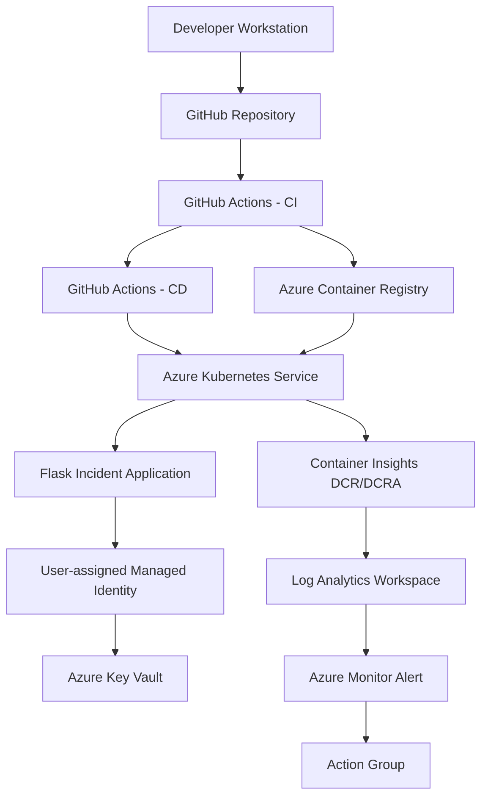
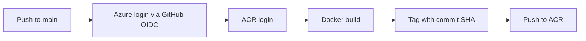
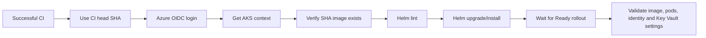
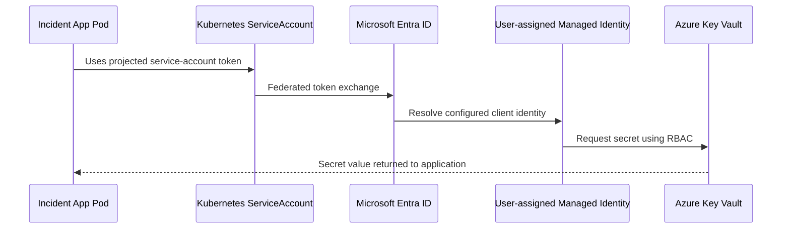
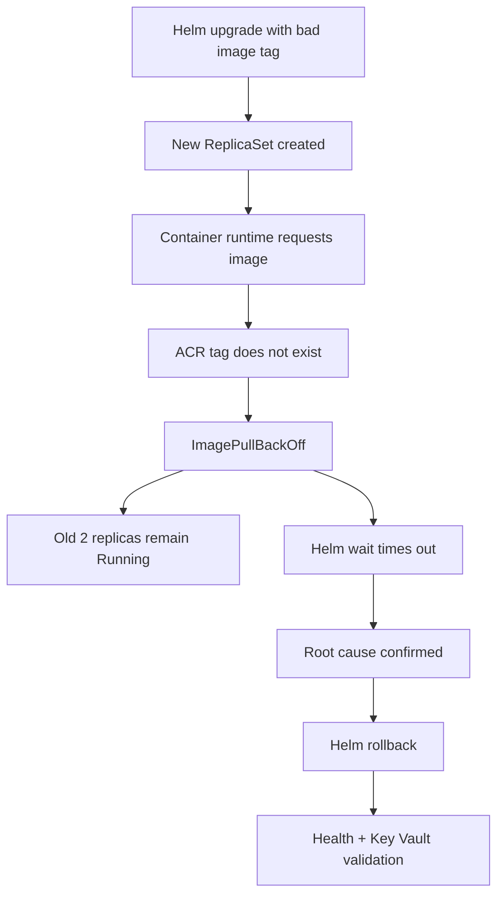

# Architecture

## 1. Objective

This project implements a small but production-style Azure application platform. The goal is not only to deploy an application, but to demonstrate the full lifecycle around it: infrastructure provisioning, image build, release automation, identity, secret access, monitoring, alerting, troubleshooting, and rollback.

## 2. High-level architecture



## 3. Infrastructure architecture

Terraform manages the Azure foundation. A dedicated bootstrap layer creates remote-state resources, while the environment layer composes reusable modules.

```text
terraform/bootstrap
  -> Terraform state resource group
  -> Azure Storage account
  -> private state container
  -> state access role assignment

terraform/environments/dev
  -> resource-group module
  -> network module
  -> nsg module
  -> acr module
  -> monitoring module
  -> aks module
  -> key-vault module
  -> container-insights module
```

The separation is intentional. The backend must exist before the environment can use it, so state bootstrap is isolated from the main platform configuration.

## 4. Network design

The development environment uses a dedicated VNet and separate subnets for platform workloads.

```text
VNet: 10.10.0.0/16

snet-aks-dev: 10.10.1.0/24
snet-app-dev: 10.10.2.0/24
```

Network Security Groups are created independently and associated with the appropriate subnet. AKS uses Azure CNI Overlay for pod networking.

## 5. AKS design

The AKS cluster is configured with:

- Kubernetes RBAC.
- OIDC issuer enabled.
- AKS Workload Identity enabled.
- Azure CNI Overlay networking.
- Standard load balancer.
- Two system-pool nodes in the development environment.
- Explicit upgrade settings.
- Azure Monitor / Container Insights integration.

The application deployment uses two baseline replicas and the following rolling-update behavior:

```yaml
strategy:
  type: RollingUpdate
  rollingUpdate:
    maxUnavailable: 0
    maxSurge: 1
```

This protects the existing baseline capacity while a replacement pod is being created.

## 6. Container and image architecture

The Flask application is packaged in a Docker image based on `python:3.13-slim` and runs with Gunicorn as a non-root user.

The container includes:

- application code,
- templates and static files,
- Python dependencies,
- health check,
- `APP_VERSION` and `ENVIRONMENT` runtime configuration.

Images are stored in ACR. The normal CI path tags each image with the Git commit SHA, providing immutable release traceability.

## 7. CI/CD architecture

### CI



### CD



The CD workflow deploys the exact artifact produced by CI rather than rebuilding or resolving a mutable tag.

## 8. GitHub-to-Azure identity

GitHub Actions authenticates to Azure through a Microsoft Entra application with a federated credential scoped to the repository and branch.

```text
GitHub Actions OIDC token
  -> Entra federated identity credential
  -> short-lived Azure token
  -> Azure APIs / ACR / AKS
```

This removes the need to store a long-lived Azure client secret in GitHub.

## 9. AKS-to-Key Vault identity

The application uses AKS Workload Identity.



The Kubernetes service account is annotated with the managed identity client ID and the pod template carries the workload identity label.

The Flask endpoint `/api/keyvault-check` validates access but never returns the secret value.

## 10. Monitoring architecture

The cluster sends telemetry to Log Analytics through Azure Monitor Agent and Container Insights.

```text
AKS
  -> Azure Monitor Agent (ama-logs)
  -> Data Collection Rule
  -> Data Collection Rule Association
  -> Log Analytics Workspace
  -> KQL
  -> Scheduled Query Alert
  -> Action Group
  -> Email notification
```

The project validated the following data sources:

- `KubePodInventory` for pod state and restarts.
- `ContainerLogV2` for container/application logs.
- `Perf` for CPU and memory metrics.
- `KubeEvents` for Kubernetes events.
- `KubeNodeInventory` for node inventory and state.

## 11. Release resilience behavior

A deliberate release using a nonexistent image tag proved the deployment strategy:



The key reliability point is that `maxUnavailable: 0` prevented the failed new pod from reducing the two healthy existing replicas.

## 12. Design trade-offs

This is a development/portfolio environment, so some production controls are deliberately simplified. Examples include the AKS Free tier and public network access for services where private endpoints were not required for the learning goal.

For a production implementation, likely extensions would include private AKS/API access, private ACR/Key Vault endpoints, policy-as-code, separate system/user node pools, Pod Disruption Budgets, ingress with TLS, WAF, backup/DR design, image vulnerability scanning, environment promotion, and stronger release approval gates.
