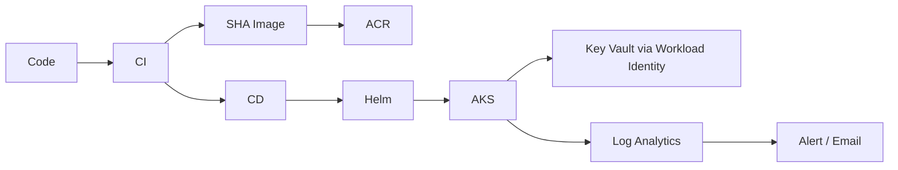

# Project Handbook

This handbook explains what was built, why each major action was needed, representative commands, expected/actual results, and the interview lesson. It is intentionally written as an implementation narrative rather than a copy of the source files.

## Phase 1 - Application foundation

### What was done

Built a Flask CloudOps/incident dashboard with health, version, incident, and Key Vault validation endpoints.

### Why

A DevOps platform project needs a real workload so containerization, deployment, identity, monitoring, and rollback can be demonstrated against application behavior.

### Representative commands

```powershell
python -m venv .venv
.\.venv\Scripts\Activate.ps1
pip install -r requirements.txt
python app.py
```

### Result

The application exposed operational endpoints including `/health` and later `/api/keyvault-check`.

### Interview lesson

The application is deliberately simple so the project focuses on platform engineering rather than application complexity.

---

## Phase 2 - Docker containerization

### What was done

Created a Python slim-based image, installed dependencies, copied only required application content, created a non-root user, exposed port 8080, added a container health check, and ran the service with Gunicorn.

### Why

The same immutable application package can be built once and run consistently locally, in CI, and in AKS.

### Representative commands

```powershell
docker build -t incident-app:1.0.0 .\app
docker run --rm -p 8080:8080 incident-app:1.0.0
curl.exe http://localhost:8080/health
```

### Result

Container health and Flask endpoints worked locally.

### Interview lesson

A production container should not depend on the Flask development server and should avoid running as root when unnecessary.

---

## Phase 3 - Terraform remote-state bootstrap

### What was done

Created a separate Terraform bootstrap configuration for the state resource group, Azure Storage account, private state container, and access role.

### Why

The main environment cannot use a remote backend until that backend exists. Keeping bootstrap separate avoids a circular dependency.

### Representative commands

```powershell
cd terraform\bootstrap
terraform fmt
terraform init
terraform validate
terraform plan -out=tfplan
terraform apply tfplan
```

### Expected result

Remote-state resources created successfully and provider selections locked in `.terraform.lock.hcl`.

### Interview lesson

Commit provider lock files, but never commit Terraform state or plan artifacts.

---

## Phase 4 - Core Azure network and resource group

### What was done

Provisioned the development resource group, VNet, AKS/application subnets and NSGs through reusable Terraform modules.

### Why

Networking should be deterministic and version controlled, not created manually in the portal.

### Representative flow

```text
environment main.tf
  -> resource-group module
  -> network module
  -> nsg module
```

### Result

The environment had a repeatable network foundation for AKS and future services.

### Interview lesson

Modules improve reuse, but the environment composition still owns dependencies such as passing a subnet ID into AKS.

---

## Phase 5 - Azure Container Registry

### What was done

Created ACR through Terraform with the admin account disabled.

### Why

AKS and CI need a controlled private image registry. Admin credentials were avoided in favor of Azure identities/RBAC.

### Representative commands

```powershell
az acr login --name acrcloudopsdevw9yni0
docker tag incident-app:1.0.0 acrcloudopsdevw9yni0.azurecr.io/incident-app:1.0.0
docker push acrcloudopsdevw9yni0.azurecr.io/incident-app:1.0.0
```

### Result

Images were stored in ACR and later pulled by AKS.

### Interview lesson

Registry authentication should use identities and least-privilege roles instead of a shared admin password.

---

## Phase 6 - AKS

### What was done

Provisioned AKS with Terraform, including RBAC, OIDC issuer, Workload Identity, Azure CNI Overlay and explicit upgrade settings.

### Key issue

The first selected VM family had insufficient quota. Regional quota was inspected and the node pool was moved to a family with available capacity.

### Representative commands

```powershell
az vm list-usage --location centralindia --output table
az aks get-credentials --resource-group rg-cloudops-dev --name aks-cloudops-dev
kubectl get nodes -o wide
```

### Result

A two-node system pool became Ready and the cluster could schedule workloads.

### Interview lesson

Quota failures are infrastructure-capacity constraints, not Terraform syntax problems. Diagnose the cloud platform limit before changing IaC blindly.

---

## Phase 7 - Kubernetes baseline

### What was done

Created namespace, ConfigMap, Deployment, Service and HPA manifests. The Deployment used two replicas, resource requests/limits, readiness/liveness probes and a safe rolling strategy.

### Representative commands

```powershell
kubectl apply -f .\kubernetes\base\namespace.yaml
kubectl apply -f .\kubernetes\base\
kubectl get all -n cloudops-dev
```

### Validation performed

- pod deployment,
- service connectivity,
- self-healing behavior,
- rolling update behavior,
- ConfigMap-driven configuration,
- HPA scaling/load testing.

### Interview lesson

The controller model is more important than memorizing commands: Kubernetes continuously reconciles actual state toward desired state.

---

## Phase 8 - Helm release management

### What was done

Converted the application deployment into a Helm chart with templates for ConfigMap, Deployment, HPA, Service and ServiceAccount.

### Why

Helm adds parameterized releases, history and rollback, making deployment management more realistic than manually editing raw YAML.

### Migration issue

The resources already existed from `kubectl apply`, so ownership/field-manager conflicts had to be resolved during adoption.

### Representative commands

```powershell
helm lint .\helm\incident-app
helm upgrade --install incident-app .\helm\incident-app -n cloudops-dev
helm history incident-app -n cloudops-dev
```

### Interview lesson

Do not keep two competing deployment managers for the same object. After adoption, Helm became the application release source of truth.

---

## Phase 9 - GitHub Actions CI/CD and OIDC

### What was done

Configured GitHub Actions to authenticate to Azure using OIDC federation. CI builds/pushes a SHA-tagged image. CD runs after successful CI, checks out the same SHA, verifies the artifact in ACR and deploys with Helm.

### Why

This separates build from release and removes long-lived Azure secrets from GitHub.

### Key issue

The federated identity could authenticate but initially lacked sufficient Azure RBAC, producing `No subscriptions found`/access symptoms until roles were added.

### Result

CI and CD both ran successfully, with immutable SHA image traceability.

### Interview lesson

Identity federation solves credential management, but authorization still requires correct RBAC at the right scopes.

---

## Phase 10 - Key Vault and AKS Workload Identity

### What was done

Terraform created Key Vault, a user-assigned managed identity, a federated identity credential tied to the AKS OIDC issuer and the `cloudops-dev/incident-app` service account, plus Key Vault read permission for the runtime identity.

The Helm chart was updated with:

- service account creation,
- managed identity client ID annotation,
- `azure.workload.identity/use: "true"` pod label,
- Key Vault URI environment configuration.

The Flask application used `DefaultAzureCredential` and `SecretClient`.

### Key issues

1. Helm YAML indentation temporarily created an invalid Deployment.
2. The signed-in user initially lacked data-plane rights to seed the demo Key Vault secret.
3. A manual federated-token test needed PowerShell-safe variable handling.

### Result

`/api/keyvault-check` confirmed:

```text
authentication = AKS Workload Identity
key_vault_access = true
secret_loaded = true
```

### Interview lesson

Runtime identity should be proven end-to-end from pod token -> Entra federation -> managed identity -> Key Vault RBAC -> application SDK.

---

## Phase 11 - Monitoring, Log Analytics and alerting

### What was done

Created a Log Analytics workspace and enabled the AKS monitoring addon. When telemetry did not appear, a dedicated Container Insights module was added with a DCR and DCRA configured for `Microsoft-ContainerInsights-Group-Default` and `enableContainerLogV2 = true`.

### Why

Agent health alone was not enough; the project needed real telemetry available for operations and alerting.

### Validation

`KubePodInventory` showed incident-app pods, `ContainerLogV2` showed Flask/Azure SDK logs, `Perf` exposed resource metrics, and Kubernetes events were queryable.

### Alerting

Created an action group and a scheduled query alert that looked for application error terms over a five-minute window.

A controlled error log was emitted from a temporary pod, the query matched it, the alert fired, and email delivery was confirmed. The temporary pod was deleted afterward.

### Interview lesson

Observability is only complete when data ingestion, queryability, detection and notification are all proven.

---

## Phase 12 - Failure simulation, diagnosis and rollback

### What was done

Captured the known-good image and Helm revision, then intentionally upgraded the release with `broken-image-test` and omitted automatic rollback protection so the failed state could be inspected.

### Failure

The new pod entered `ImagePullBackOff`. The two previous replicas remained Running.

### Diagnosis

```powershell
kubectl get pods -n cloudops-dev -o wide
kubectl get pod <bad-pod> -n cloudops-dev -o jsonpath="{.spec.containers[0].image}"
az acr repository show --name acrcloudopsdevw9yni0 --image "incident-app:broken-image-test" --output table
```

ACR returned that the tag did not exist.

### Recovery

```powershell
helm rollback incident-app 11 -n cloudops-dev --wait --timeout 5m
```

Helm created revision 13 as the deployed rollback to revision 11.

### Validation

`/health` returned healthy with the known-good SHA and `/api/keyvault-check` confirmed Key Vault access.

### Interview lesson

A good incident response proves root cause before recovery and then validates the complete dependency path after rollback, not just pod status.

---

## Final platform flow



## Final skill map

This one project demonstrates practical exposure to:

```text
Azure infrastructure
Terraform modules + remote state
Docker
ACR
AKS / Kubernetes
Helm
GitHub Actions
OIDC federation
Entra / Azure RBAC
AKS Workload Identity
Key Vault
Azure Monitor
Log Analytics / KQL
Container Insights / DCR / DCRA
Alerting
Incident troubleshooting
Release rollback
Git / repository hygiene
```
